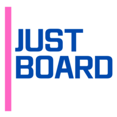
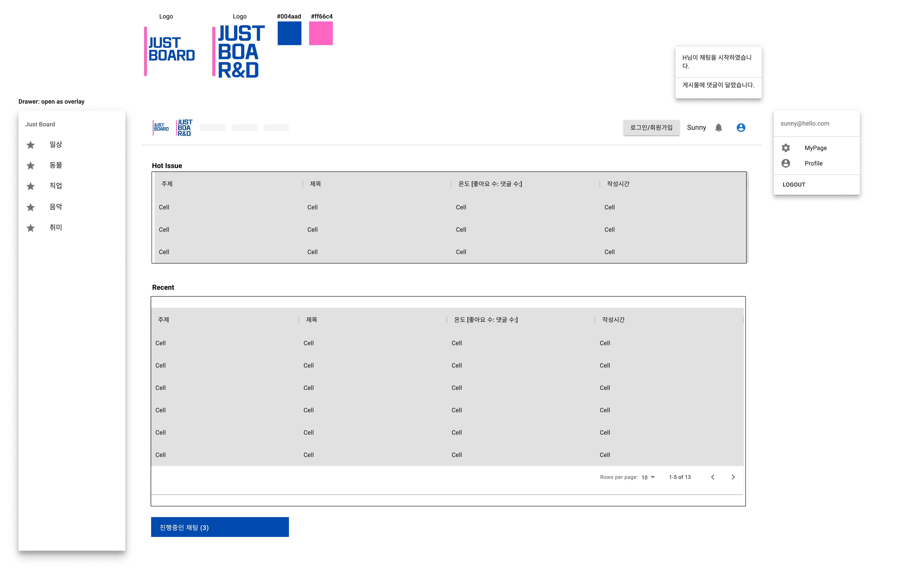
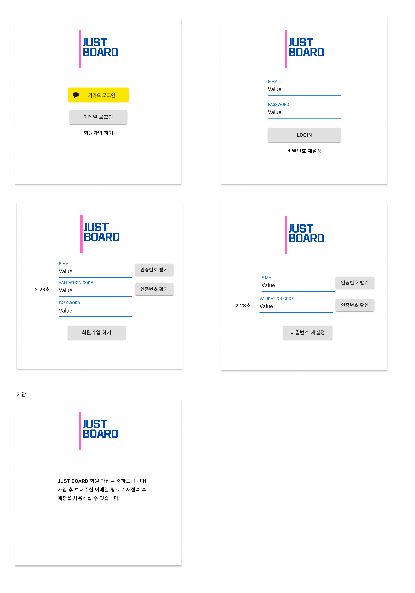
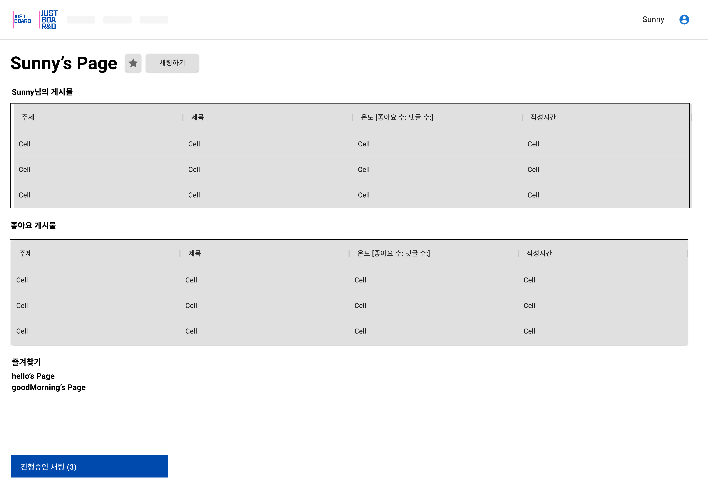
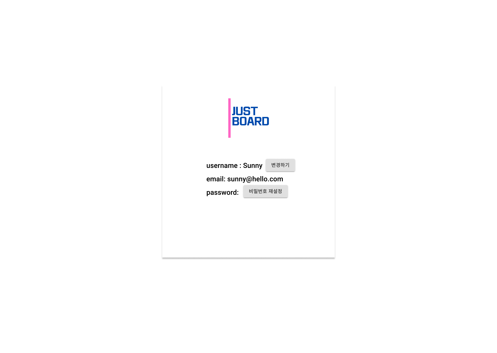
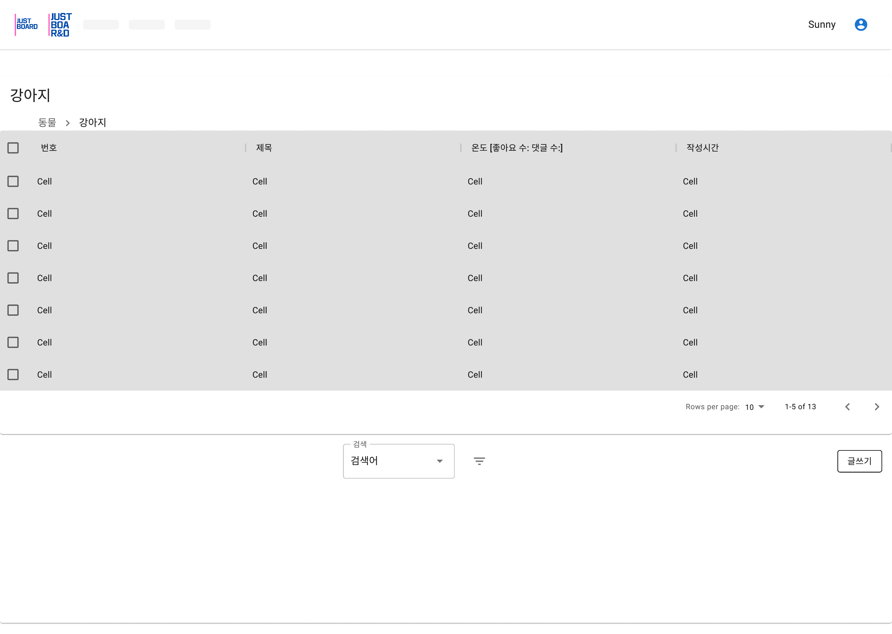
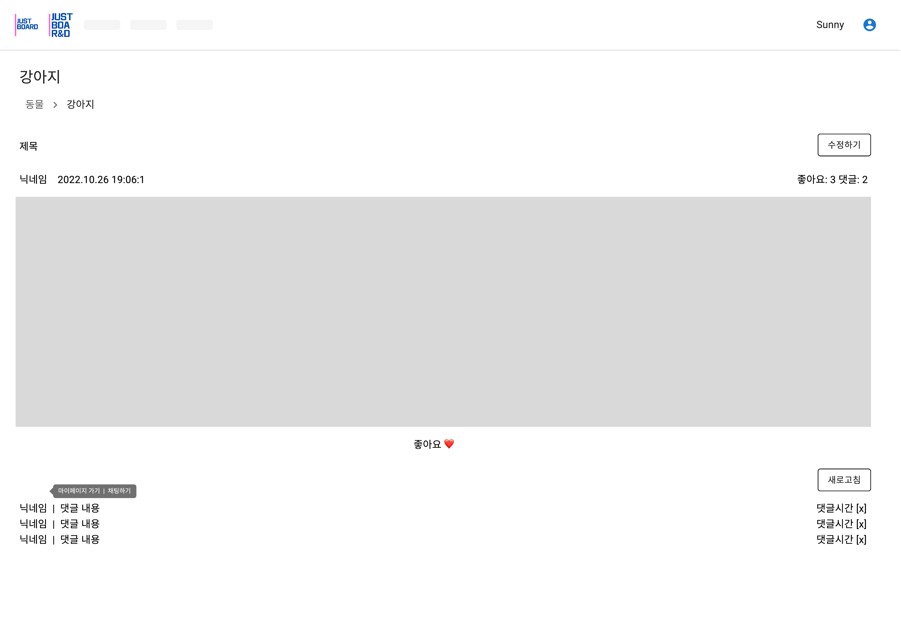
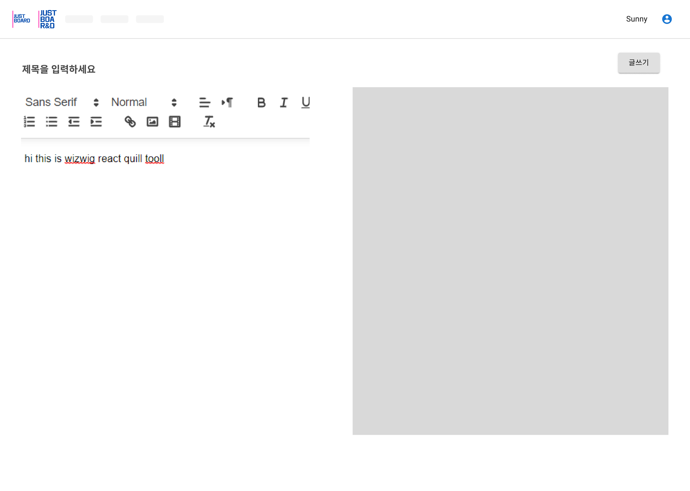
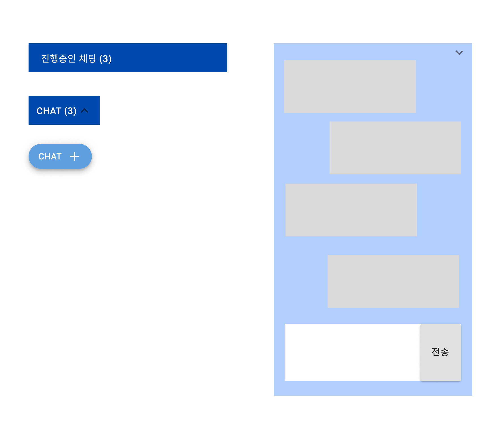

 

 

## ⭐ 프로젝트 설명 (Project Explanation)
### Mini Project!  
주요 관심사를 공유하고, 댓글로 소통하고 채팅하는 간단한 게시판  
(Sharing interested inssues with comments and chats in the simple board)
 

## 📋 와이어프레임 (Wireframes)
- ### 메인페이지(Main Page)

- ### 로그인(Login)

- ### 마이페이지(My Page)

- ### 프로필(Profile)

- ### 게시판(Board)

- ### 상세페이지(Detail)

- ### 글쓰기(Write)

- ### 채팅(Chat)

## 🍭주요 기능(Features)
- ### 게시판(Board)
- ### 글쓰기(Write)
    - wizwig 방식(wizwig method)
- ### 채팅(Chat)
- ### 로그인(Login)
    - 카카오 소셜 로그인(Login using SNS called Kakao)
    - 이메일 인증 로그인(Login with the authorized email)
 

## 👯‍♀️ 프로젝트 구성원(Project member)
|Github Id|Role|
|-------|---|
|[CINY4612](https://github.com/CINY4612)|backend|
|[lovysunny7](https://github.com/lovysunny7)|frontend|

----
----
### 🎞 프론트엔드 라이브러리(frontend used library)
yarn add @mui/material @emotion/react @emotion/styled  
yarn add @fontsource/roboto  
yarn add typescript @types/node @types/react @types/react-dom @types/jest --dev
yarn add react-router-dom
yarn add @mui/icons-material
yarn add @material-ui/styles
yarn add @mui/x-data-grid